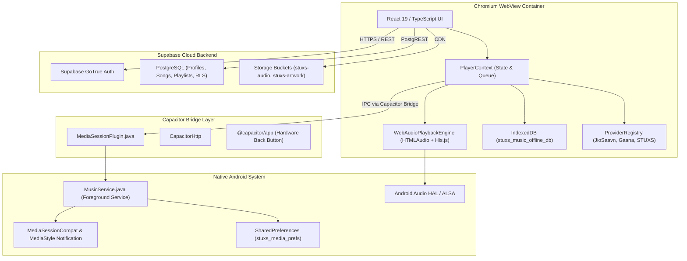
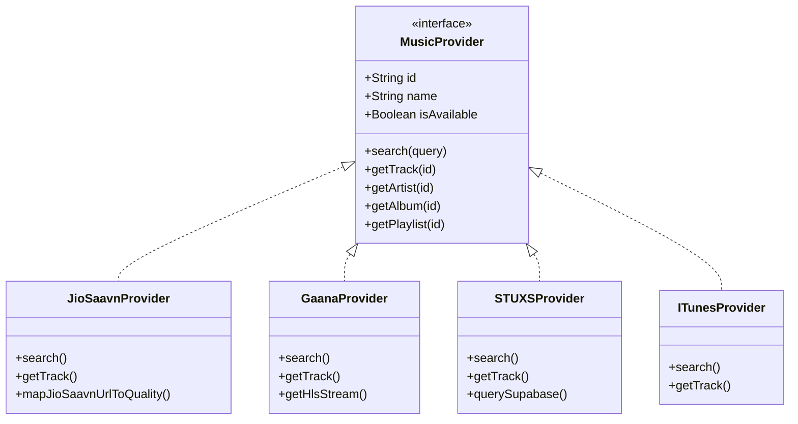
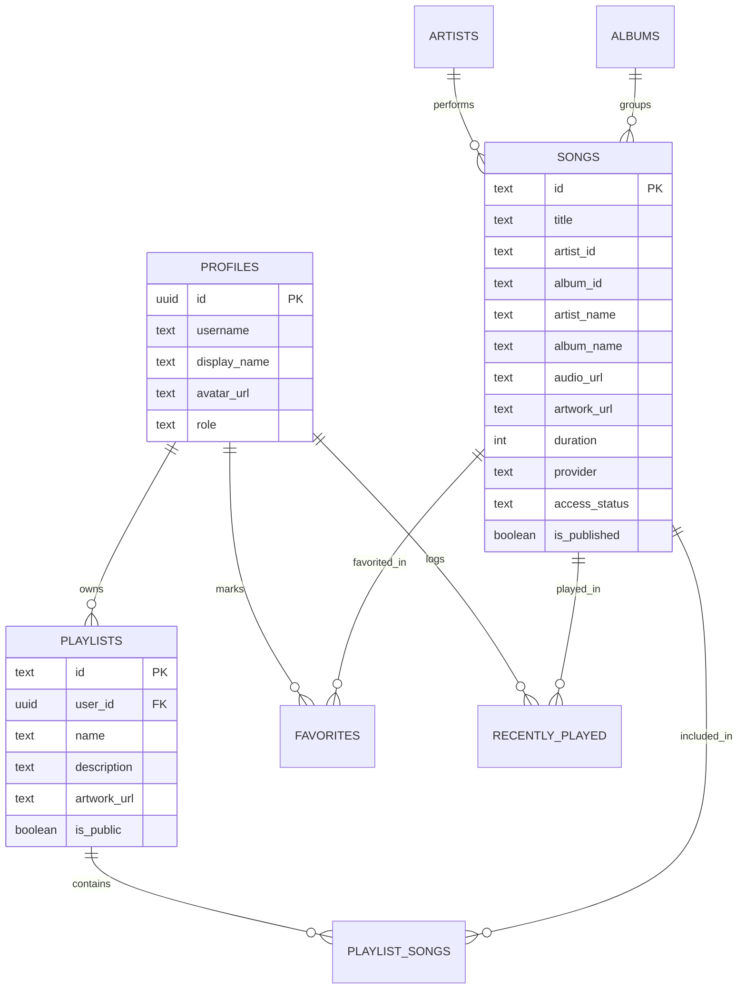
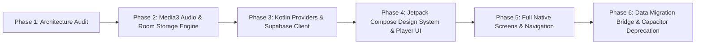

# STUXS MUSIC — FULL NATIVE ANDROID MIGRATION
## PHASE 1: COMPREHENSIVE ARCHITECTURE AUDIT & TECHNICAL SPECIFICATION

---

## 1. Executive Summary

STUXS Music currently runs on a **hybrid web-native architecture**:
- **Frontend / Client UI**: React 19 + TypeScript + Tailwind CSS running inside a Chromium Android WebView container managed by Capacitor 8.5.0.
- **Audio Engine**: Dual `<audio>` elements (`HTMLAudioElement`) combined with `hls.js` for HLS streaming, orchestrated via a custom `WebAudioPlaybackEngine`.
- **System Integration**: A native Java Android service (`MusicService.java`) that maintains a single `MediaSessionCompat` and foreground `NotificationCompat.MediaStyle` notification, synchronized through a custom Capacitor plugin bridge (`MediaSessionPlugin.java`).
- **Offline Storage**: Browser IndexedDB (`stuxs_music_offline_db`) storing raw audio Blobs directly inside the WebView's private sandbox.
- **Cloud Backend**: Supabase PostgreSQL (GoTrue authentication, relational tables with Row Level Security, and Supabase Storage buckets).

### Why Migrate to 100% Native Android?
1. **Audio Engine Isolation & Independence**: In the hybrid model, if the Android OS reclaims the WebView process under memory pressure or aggressive battery optimizations (especially common on OEM skins like OriginOS, ColorOS, MIUI/HyperOS, and One UI), audio playback stutters or terminates despite a running foreground service. A native Android audio engine built on **AndroidX Media3 (ExoPlayer)** operates as a first-class OS media citizen with native AudioFocus, hardware offloading, and continuous background resilience.
2. **True Native Media Storage**: IndexedDB is not designed for storing gigabytes of binary audio files. It causes database bloat, garbage-collection pauses, and high memory consumption when converting Blobs to Object URLs. Native filesystem storage (`context.filesDir` / scoped external storage) managed by Room Database provides instant startup and zero memory copy overhead.
3. **UI Performance & 120Hz Fluidity**: While the web UI is polished and optimized, complex views (Now Playing ambient glow, synchronized line-by-line lyric animations, and 200+ track playlists) suffer from WebView compositor overhead. **Jetpack Compose** provides GPU-accelerated rendering, zero-bridge gesture recognition, and native list recycling with zero DOM allocation overhead.
4. **Elimination of Bridge Overhead**: State synchronization between TypeScript, Capacitor, and native Java currently incurs IPC serialization overhead every 4 seconds and on every track transition. Native Kotlin architecture eliminates all serialization layers.

---

## 2. Current Architecture



### 2.1 React / TypeScript Layer
- **Version**: React 19.2.8, TypeScript ~6.0.2, Vite 8.2.2.
- **Structure**:
  - `src/context/`: `AuthContext`, `PlayerContext`, `LibraryContext`, `SettingsContext`, `SearchContext`, `ToastContext`.
  - `src/providers/`: `ProviderRegistry`, `JioSaavnProvider`, `GaanaProvider`, `STUXSProvider`, `ITunesProvider`, `SpotifyProvider`, `AmazonMusicProvider`.
  - `src/services/`: `DownloadService`, `StorageService`, `LocalMusicService`, `M3UParserService`, `MetadataResolverService`, `STUXSUploadService`.
  - `src/screens/`: `HomeScreen`, `SearchScreen`, `LibraryScreen`, `PlaylistScreen`, `AlbumScreen`, `ArtistScreen`, `SettingsScreen`, `AuthScreen`.
  - `src/components/`: `AppLayout`, `MiniPlayer`, `NowPlayingModal`, `QueueDrawer`, `LyricsView`, `TrackRow`, etc.

### 2.2 Native Android Project Structure
- **Location**: `android/`
- **Gradle Configuration**:
  - `compileSdk`: 36, `minSdk`: 24, `targetSdk`: 36.
  - Gradle Plugin: 8.7.2, JDK: 21 (`jbr-21.0.11`).
  - Dependencies: `androidx.appcompat:1.7.1`, `androidx.media:1.7.0`, `androidx.core:1.17.0`, `core-splashscreen:1.2.0`.
- **Key Native Classes**:
  1. `MainActivity.java`: Extends `BridgeActivity`. Configures edge-to-edge transparent status and navigation bars, sets `#0B0B0F` background, handles native window insets, and registers plugins.
  2. `MusicService.java`: Extends `android.app.Service`. Implements foreground service (`FOREGROUND_SERVICE_TYPE_MEDIA_PLAYBACK`), authoritative `MediaSessionCompat`, MediaButton receiver handling, `MediaStyle` notification, bitmap artwork loading, and `SharedPreferences` state persistence.
  3. `MediaSessionPlugin.java`: Custom Capacitor plugin bridging metadata, playback state, and media actions between JavaScript and `MusicService`.
  4. `DeviceInfoHelper.java`: Helper detecting Android OEM skins (OriginOS, ColorOS, HyperOS, etc.).

---

## 3. Playback Architecture

### 3.1 End-to-End Playback Flow

```
[User Taps Play]
       │
       ▼
PlayerContext.startTrackPlayback(track)
       │
       ├─► Increments playbackGenerationRef (cancels any in-flight requests)
       │
       ├─► resolvePlayableSource(track)
       │      │
       │      ├─► 1. Verified Offline Download? (DownloadService / IndexedDB blob)
       │      ├─► 2. Local Device Audio? (LocalMusicService blob URL)
       │      ├─► 3. Existing Direct Audio URL? (validateAudioStreamUrl)
       │      └─► 4. Catalog Match? (ProviderRegistry.resolvePlayableTrack)
       │
       ├─► Updates UI State (currentTrack, isPlaying=true, progress=0)
       │
       ├─► Persists to localStorage ('stuxs_last_played_track')
       │
       ├─► updateNativeMediaMetadata() via Capacitor Bridge
       │      │
       │      └─► MusicService: Updates MediaSessionCompat & posts MediaStyle Notification
       │
       ▼
WebAudioPlaybackEngine.play(resolvedTrack)
       │
       ├─► Selects inactive deck (Deck A or B)
       ├─► Decides engine:
       │      ├─► HLS Stream (.m3u8)? ──► Instantiates Hls.js on deck audio
       │      └─► Progressive (MP3/AAC/FLAC)? ──► Sets audio.src directly
       │
       ├─► Applies crossfade curve via requestAnimationFrame
       ├─► Starts HTMLAudioElement.play()
       │
       ▼
Playback Listeners Emit Updates:
       ├─► onTimeUpdate ──► Updates UI progress & throttles native MediaSession seek position
       ├─► onTrackEnded ──► Triggers nextTrack() in PlayerContext
       └─► onTrackTransition ──► Crossfades seamlessly to preloaded deck
```

### 3.2 Key Playback Components & Ownership

| Component | Technology | Role & Ownership |
| :--- | :--- | :--- |
| **`PlayerContext.tsx`** | React Context / Hooks | Controls player state, current queue, repeat/shuffle logic, track switching, and generation guards. |
| **`WebAudioPlaybackEngine.ts`** | Web Audio / HTML5 | Owns dual audio decks (`deckA`, `deckB`), handles volume interpolation (crossfade), and decodes audio bytes via Chromium. |
| **`Hls.js`** | JavaScript HLS Client | Demuxes and feeds fragmented MP4/TS segments into Media Source Extensions (MSE) for Gaana and HLS streams. |
| **`nativeMediaSession.ts`** | TypeScript Capacitor wrapper | Serializes track metadata and playback commands into JSON for native dispatch. |
| **`MusicService.java`** | Android Native Service | Owns system `MediaSessionCompat`, lock-screen transport controls, Bluetooth/headset media buttons, and SystemUI notification. |

### 3.3 Native Gaps in Playback
- **Dual Audio Pipeline**: The actual audio plays in Chromium, but Android OS believes the native service is producing the audio. Audio focus events (e.g. phone call interruption or navigation prompts) cannot duck or pause the audio hardware natively at the ALSA/HAL level without round-tripping through JavaScript.
- **Latency**: Seek commands initiated from the lock-screen must travel: SystemUI $\rightarrow$ `MediaSessionCompat.Callback` $\rightarrow$ `MusicService` $\rightarrow$ `MediaSessionPlugin` $\rightarrow$ Capacitor Bridge $\rightarrow$ `nativeMediaSession` listener $\rightarrow$ `PlayerContext` $\rightarrow$ `WebAudioPlaybackEngine` $\rightarrow$ `audio.currentTime = pos`. This adds 15–50ms of unnecessary latency.

---

## 4. Download & Offline Architecture

### 4.1 Detailed Storage Trace
1. **Download Initiation**: User taps download in `TrackRow` or `TrackActionMenu`. `DownloadService.downloadTrack()` is called.
2. **Download Execution**:
   - Resolves streaming URL via `providerRegistry`.
   - On Android, invokes `CapacitorHttp.get({ responseType: 'blob' })` to bypass WebView CORS restrictions.
   - On Web, uses `fetch()`.
3. **Storage & Verification**:
   - Verifies received audio bytes: must be a valid `Blob` and size must be $\ge 10\text{KB}$.
   - Persists into **IndexedDB database `stuxs_music_offline_db`**, store `downloaded_tracks`.
   - Schema:
     ```ts
     interface StoredAudioRecord {
       id: string;            // e.g. "jiosaavn-12345"
       track: Track;          // Full serialized track metadata
       blob: Blob;            // Raw binary audio stream
       downloadedAt: number;  // Timestamp
       fileSize: number;      // Exact bytes
     }
     ```
4. **Offline Playback Resolution**:
   - On startup, `DownloadService.init()` reads all records from IndexedDB.
   - For every verified record, creates an in-memory Object URL: `URL.createObjectURL(record.blob)`.
   - When offline, `PlayerContext` uses this `blob:` URL. HTMLAudioElement streams directly from local device memory.
5. **Physical Storage on Android**:
   - The audio bytes live inside Chrome's private LevelDB storage at:
     `/data/data/com.stuxs.music/app_webview/Default/IndexedDB/https_localhost_0.indexeddb.leveldb/`
     or `/data/data/com.stuxs.music/app_webview/IndexedDB/`

### 4.2 Migration Compatibility Requirement (CRITICAL)
In native Android, downloads must be stored as raw files in `context.filesDir + "/downloads/{trackId}.mp3"` (or `.m4a`), with metadata indexed in **Room Database**. To prevent existing users from having their downloaded songs wiped when updating from hybrid to native, a one-time migration bridge must read the IndexedDB LevelDB records or provide a transparent migration path.

---

## 5. Provider Architecture

STUXS Music employs a strict provider abstraction via `MusicProvider` and `ProviderRegistry`:



### 5.1 Provider Matrix

| Provider | ID | Audio Format | Stream Quality | Search | Playback | Offline Download | Offline Handling |
| :--- | :--- | :--- | :--- | :--- | :--- | :--- | :--- |
| **JioSaavn** | `jiosaavn` | Direct MP4/AAC | 320 kbps Studio Master | Yes | Full Audio | Yes | Blocked unless pre-downloaded |
| **Gaana** | `gaana` | HLS (.m3u8) | 128-320 kbps Variable AAC | Yes | Full Audio | Yes | Blocked unless pre-downloaded |
| **STUXS Core**| `stuxs` | MP3 / FLAC | Lossless / Original | Yes | Full Audio | Yes | Blocked unless pre-downloaded |
| **Local / M3U**| `local` | MP3/AAC/WAV | Source Native Bitrate | Yes | Full Audio | Yes | Always available offline |
| **iTunes** | `itunes` | AAC Preview | 128 kbps (30s) / Auto-resolved | Yes | Resolved to 320k | No (Preview) | Blocked |
| **Spotify** | `spotify` | Metadata only | Developer API | Yes | Metadata only | No | Blocked |
| **Amazon** | `amazon` | Metadata only | Developer API | Yes | Metadata only | No | Blocked |

---

## 6. Search Architecture

The STUXS search engine uses a multi-tier pipeline optimized for low latency and high relevance:

1. **Input Debouncing**: 300ms debounce in `SearchScreen.tsx`.
2. **Query Normalization** (`searchIntelligence.ts`):
   - Lowercases, cleans noisy punctuation, and strips rip tags.
   - Transliteration normalization: Maps common Indian/Hinglish phonetic variations (e.g. `"samjawan"` $\rightarrow$ `"samjhawan"`, `"kesriya"` $\rightarrow$ `"kesariya"`, `"tumhi ho"` $\rightarrow$ `"tum hi ho"`).
   - Query Variants: Generates alternate phonetic stems.
3. **Parallel Provider Queries**:
   - Queries `STUXSProvider`, `JioSaavnProvider`, and `GaanaProvider` concurrently.
   - Caches completed results in `searchCache` (LRU up to 120 queries).
4. **Relevance Scoring Engine (`scoreTrack`)**:
   - Exact title match: `+250`
   - Prefix match: `+160`
   - Exact artist match: `+70`
   - Meaningful token coverage: `+100`
   - Canonical studio master: `+120`
   - Derivative penalty (covers, remixes, sped up, 8D audio): `-140`
   - Provider trust weight: JioSaavn (`120`), Gaana (`120`), STUXS (`120`), Local (`110`).
5. **Deduplication (`deduplicateTracks`)**:
   - Groups near-identical song matches using fuzzy string distance and preserves the highest-scoring studio master version.
6. **Playlist Search**:
   - Matches against user's local and cloud playlists without artificially boosting less relevant songs above studio hits.

---

## 7. Supabase Architecture

### 7.1 Authentication & Persistence
- **Client**: `@supabase/supabase-js` v2.112.4.
- **Persistence**: Managed via GoTrue in localStorage (`sb-ebadlsnwjvkgkdqnulea-auth-token`).
- **Offline Protection**: Auth state change listener in `AuthContext.tsx` is strictly guarded to ignore network loss, ensuring offline users remain authenticated and their local player state is preserved.

### 7.2 Database Schema Overview



### 7.3 Storage Buckets & Policies
- `stuxs-audio`: Public bucket (100MB limit per file). Public can stream; only users with `role = 'developer'` verified by `public.is_developer(auth.uid())` can upload/update/delete.
- `stuxs-artwork`: Public bucket (10MB limit per file). Public can view; only developers can upload.

---

## 8. UI Architecture

### 8.1 Screen Inventory & State Management

| Screen / Component | File | State Scope | Key Responsibilities | Performance Characteristics |
| :--- | :--- | :--- | :--- | :--- |
| **`HomeScreen`** | `screens/HomeScreen.tsx` | Global & Local | Trending carousels, recent songs, quick play buttons, hero banner. | Multiple image carousels; needs image caching. |
| **`SearchScreen`** | `screens/SearchScreen.tsx` | `SearchContext` | Search input, live results, category filters, history chips. | High re-render potential during typing; debounced. |
| **`LibraryScreen`** | `screens/LibraryScreen.tsx` | `LibraryContext` | User playlists, liked songs, downloaded songs, local files. | Large lists; IndexedDB reads for downloads tab. |
| **`PlaylistScreen`** | `screens/PlaylistScreen.tsx` | Local | Playlist header, tracklist, reorder tracks, play all, shuffle. | Long lists (50–300 items); scroll performance critical. |
| **`ArtistScreen`** | `screens/ArtistScreen.tsx` | Local | Monthly listeners, top tracks, discography, verified badge. | Nested horizontal carousels + vertical list. |
| **`AlbumScreen`** | `screens/AlbumScreen.tsx` | Local | Album cover, release date, full tracklist, copyright. | Clean vertical tracklist. |
| **`MiniPlayer`** | `components/player/MiniPlayer.tsx`| `PlayerContext` | Persistent floating pill with title, artist, play/pause, next. | Must never re-render unnecessarily on timeupdate. |
| **`NowPlayingModal`**| `components/player/NowPlayingModal.tsx`| `PlayerContext` | Fullscreen modal, dynamic ambient blur, seek slider, controls. | Heavy GPU canvas blur; slider requires high-frequency sync. |
| **`QueueDrawer`** | `components/player/QueueDrawer.tsx`| `PlayerContext` | Up Next, drag-and-drop queue reordering, smart auto-queue. | Reorder animations and drag handlers. |
| **`LyricsView`** | `components/player/LyricsView.tsx` | Local + Emitter | Synchronized line-by-line scrolling lyrics. | Continuous scroll updates timed to playback position. |
| **`SettingsScreen`**| `screens/SettingsScreen.tsx` | `SettingsContext`| Audio quality selector, crossfade slider, theme accents. | Low re-render; preference persistence. |
| **`DeveloperUploadModal`**| `components/modals/DeveloperUploadModal.tsx`| Local | File drop, ID3 parsing, online metadata enrichment, upload. | Audio file reading and binary uploading. |

---

## 9. Android System Integration

The native Android layer currently consists of three Java components:

1. **`MusicService.java`**:
   - **Service Type**: Started + Bound Service (`START_STICKY`).
   - **Lifecycle**: Promoted to foreground with `FOREGROUND_SERVICE_TYPE_MEDIA_PLAYBACK` when playing; detached when paused (`stopForeground(STOP_FOREGROUND_DETACH)`) to prevent notification dismissal while allowing OS memory flexibility.
   - **MediaSession**: Uses `MediaSessionCompat` (tag: `"STUXSMusicSession"`). Configures `PlaybackStateCompat` with transport flags (`PLAY`, `PAUSE`, `SKIP_TO_NEXT`, `SKIP_TO_PREVIOUS`, `SEEK_TO`, `STOP`).
   - **Notification**: Posts to channel `"stuxs_music_playback"` with `NotificationCompat.MediaStyle`. Displays track title, artist, album, action buttons, and large album artwork bitmap.
   - **WakeLock**: Holds `PowerManager.PARTIAL_WAKE_LOCK` ("STUXS:PlaybackWakeLock") during playback to prevent CPU sleep.
   - **Offline Persistence**: Writes last played track metadata and position to `SharedPreferences` (`"stuxs_media_prefs"`), which is read in `onCreate()` so lock-screen controls appear immediately even on offline cold start.
2. **`MediaSessionPlugin.java`**:
   - Bridges Capacitor calls: `setMetadata`, `setPlaybackState`, `stop`, `getDiagnostics`.
   - Listens to native `onMediaAction` and dispatches `mediaAction` events back to WebView JavaScript.
3. **`MainActivity.java`**:
   - Configures edge-to-edge window drawing, dark system navigation bar, and handles Android hardware back button events.

---

## 10. Performance Findings

During the technical inspection, several architectural bottlenecks were identified:

1. **Chromium Engine Memory Footprint**:
   - The WebView renderer process currently consumes **140MB – 260MB of RAM**. A native Android audio app using Jetpack Compose and ExoPlayer typically consumes **35MB – 65MB**.
   - On low-end or budget devices (2GB–4GB RAM), Android's `LowMemoryKiller` (LMK) frequently targets the WebView when backgrounded.
2. **DOM Tracklist Allocation Overhead**:
   - Long playlists (100–300 songs) in `PlaylistScreen.tsx` create hundreds of DOM nodes. Although lightweight, CSS flexbox calculation and touch event listeners cause noticeable frame drops during rapid scrolling.
   - Native Jetpack Compose `LazyColumn` or Android `RecyclerView` recycles views with zero DOM overhead.
3. **IndexedDB Blob Deserialization**:
   - Loading downloaded songs requires fetching binary chunks from LevelDB, instantiating `Blob` objects, and allocating memory for `URL.createObjectURL()`. This creates periodic garbage collection (GC) spikes.
4. **Cross-Process Bridge Jitter**:
   - When seeking or scrubbing, slider events fire in JavaScript $\rightarrow$ send message across Capacitor Bridge $\rightarrow$ Java updates `PlaybackStateCompat`. This round-trip causes subtle slider jitter on high refresh rate (120Hz) displays.

---

## 11. Data Compatibility

User data is divided into two distinct storage tiers that must be handled during migration:

### 11.1 Server Data (Cloud — Supabase PostgreSQL)
*No migration or schema change required. The native Android app will authenticate using the same Supabase project and read/write the same tables:*
- User accounts, passwords, and sessions (Supabase GoTrue).
- User profiles and developer roles (`profiles`).
- User cloud playlists and playlist tracks (`playlists`, `playlist_songs`).
- User favorites (`favorites`) and listening history (`recently_played`).
- STUXS catalog songs, albums, and artists (`songs`, `albums`, `artists`).
- Media files in Supabase Storage (`stuxs-audio`, `stuxs-artwork`).

### 11.2 Local Device Data (Client Storage)
*Must be migrated or preserved on device:*

| Data Item | Current Storage | Native Target Storage | Migration Strategy |
| :--- | :--- | :--- | :--- |
| **Downloaded Songs** | IndexedDB `downloaded_tracks` (Blobs) | Native file storage (`context.filesDir/downloads`) + Room DB | One-time export bridge from IndexedDB LevelDB to native disk on first native launch. |
| **Local Device Tracks** | IndexedDB `local_tracks` (Blobs) | MediaStore API / native file paths + Room DB | Native MediaStore query loads all device audio automatically with zero duplicate file storage! |
| **User Settings** | `localStorage` (`stuxs_playback_settings`) | Jetpack DataStore (Preferences / Proto) | Read from DataStore with sensible defaults matching existing settings. |
| **Accent Theme** | `localStorage` (`stuxs_accent_color`) | Jetpack DataStore | DataStore key `accent_color`. |
| **Last Played Track**| `localStorage` & `SharedPreferences` | Room DB & Jetpack DataStore | Native app can directly read the existing `stuxs_media_prefs` SharedPreferences! |

---

## 12. Native Migration Map

| Current Subsystem | Target Native Android Subsystem | Migration Difficulty | Data Compatibility Risk | Dependencies |
| :--- | :--- | :--- | :--- | :--- |
| **Audio Engine** (`HTMLAudioElement` + `Hls.js`) | **AndroidX Media3 (ExoPlayer)** | Medium | Low (None) | Audio hardware / Codecs |
| **MediaSession & Notification** (`MusicService.java` + `MediaSessionCompat`) | **AndroidX Media3 `MediaSessionService`** | Medium | Low (None) | AndroidX Media3 Session |
| **Offline Storage** (IndexedDB `downloaded_tracks`) | **Room Database + Native File Storage** | High | **HIGH** | File IO, Storage permissions |
| **Local Music** (IndexedDB `local_tracks` Blobs) | **Android `MediaStore` API** | Medium | Low | `READ_MEDIA_AUDIO` permission |
| **M3U Parser** (`M3UParserService.ts`) | **Kotlin M3U Parser + OkHttp** | Low | Low | OkHttp, Coroutines |
| **Provider Architecture** (`ProviderRegistry.ts`) | **Kotlin Provider Repository Pattern** | Medium | Low | Ktor Client / OkHttp, Coroutines |
| **Search Engine** (`searchIntelligence.ts`) | **Kotlin Search Intelligence Engine** | Medium | Low | Kotlin string utilities |
| **Supabase Client** (`@supabase/supabase-js`) | **Supabase Kotlin SDK (`io.github.jan-tennert.supabase`)** | Medium | Medium (Session token) | Ktor, Serialization |
| **UI Framework** (React 19 + Tailwind CSS) | **Jetpack Compose + Material 3 / Custom Theme** | High | Low | AndroidX Compose, Coil |
| **Image Loading** (`` + Canvas Ambient Blur) | **Coil 3 (Kotlin Image Loading) + RenderEffect** | Medium | Low | Android 12+ RenderEffect / Toolkit |
| **Synchronized Lyrics** (`LyricsService.ts`) | **Kotlin Lyrics Engine + Compose Scroll** | Low | Low | Ktor / OkHttp |
| **Developer Uploads** (`STUXSUploadService.ts`) | **Kotlin Upload Worker + Supabase Storage** | Medium | Low | WorkManager, MediaMetadataRetriever |

---

## 13. Recommended Migration Phases

To ensure zero downtime, zero data loss, and uninterrupted production operation, the migration must follow this exact sequential order:



### Phase 1: Architecture Audit & Technical Specification (Current Phase)
- Document all subsystems, schemas, protocols, and migration risks.
- Keep production app completely unmodified.

### Phase 2: Native Android Foundation (Audio & Offline Engine)
- Add **AndroidX Media3 (ExoPlayer)** and **MediaSessionService** natively in the Android project.
- Implement **Room Database** for offline song indexing.
- Create the native download manager writing directly to app-private storage.
- Verify gapless playback, crossfading, and audio focus natively.

### Phase 3: Kotlin Provider Pipeline & Supabase SDK
- Port `ProviderRegistry`, `JioSaavnProvider`, `GaanaProvider`, and `STUXSProvider` to Kotlin coroutines using **Ktor** or **OkHttp**.
- Port `searchIntelligence.ts` (scoring, transliteration, and typo tolerance) to Kotlin.
- Integrate the official **Supabase Kotlin SDK** for auth, database queries, and storage uploads.

### Phase 4: Jetpack Compose Player & Core Components
- Implement the STUXS obsidian design system (`#0B0B0F` theme, dynamic accents) in Jetpack Compose.
- Build the native **Now Playing** screen with GPU-accelerated ambient blur (`RenderEffect` / `BlurMaskFilter`).
- Build the native **MiniPlayer** with zero-latency touch gestures.
- Build native synchronized line-by-line **LyricsView**.

### Phase 5: Complete Screen Migration
- Port remaining screens to Compose: `HomeScreen`, `SearchScreen`, `LibraryScreen`, `PlaylistScreen`, `ArtistScreen`, `AlbumScreen`, `SettingsScreen`.
- Implement native `MediaStore` scanner for local device audio (instant loading without manual file picking).
- Port the Developer Upload & ID3 analysis flow using native `MediaMetadataRetriever`.

### Phase 6: Offline Data Migration & Capacitor Deprecation
- Implement a one-time startup bridge that reads existing IndexedDB LevelDB audio files and registers them in Room DB so existing users retain their downloaded songs.
- Remove Capacitor dependencies, WebView, and HTML assets from `app/build.gradle`.
- Final APK optimization with R8 / ProGuard minification.

---

## 14. Risk Report

| Risk Area | Root Cause | Impact | Mitigation Strategy |
| :--- | :--- | :--- | :--- |
| **Existing Offline Downloads** | Downloads currently reside in WebView IndexedDB LevelDB. | If WebView data is wiped or unlinked, users lose offline songs. | Build a one-time migration worker in Phase 6 that inspects the WebView IndexedDB folder and moves valid audio blobs to native app storage before deleting the web cache. |
| **Authentication / Session Continuity** | Supabase GoTrue stores JWT tokens in WebView localStorage. | Users would be logged out upon updating to native app. | In Phase 5/6, read the auth token from the WebView localStorage file (`app_webview/Local Storage/leveldb`) on first launch to automatically restore user session in Supabase Kotlin. |
| **Audio Focus / OEM Battery Optimization** | Aggressive background task killers on Chinese Android ROMs (Vivo OriginOS, Xiaomi HyperOS, Oppo ColorOS). | Service could be terminated if notification is paused. | Maintain `START_STICKY`, explicit `FOREGROUND_SERVICE_TYPE_MEDIA_PLAYBACK`, and implement Media3 `MediaSessionService` which is officially whitelisted by modern Android power managers. |
| **M3U Stream Codec Compatibility** | Some M3U streams use obsolete or exotic container formats. | Chromium played some streams that strict ExoPlayer might reject. | Configure ExoPlayer `DefaultExtractorsFactory` with `FLAG_ENABLE_INDEX_SEEKING` and relaxed container sniffing. |

---

## 15. Recommended First Implementation Phase (Phase 2 Blueprint)

When migration execution begins, the recommended first phase is:
**Phase 2: AndroidX Media3 (ExoPlayer) Audio Engine & Room Storage Foundation**

### Key Objectives for Phase 2:
1. Add `androidx.media3:media3-exoplayer:1.5.1`, `media3-session:1.5.1`, and `androidx.room:room-runtime:2.7.0` to `android/app/build.gradle`.
2. Implement native `StuxsExoPlayerEngine.kt` supporting gapless audio playback, progressive HTTP/HTTPS streams, and local storage files.
3. Replace the legacy `MusicService.java` with an AndroidX Media3 `MediaSessionService`.
4. Establish the Room database entity `DownloadedTrackEntity` and local filesystem file structure for downloads.
5. Verify that ExoPlayer plays JioSaavn, Gaana, and local M3U streams with 100% native stability, perfect lock-screen live status, and zero Chromium dependency.
