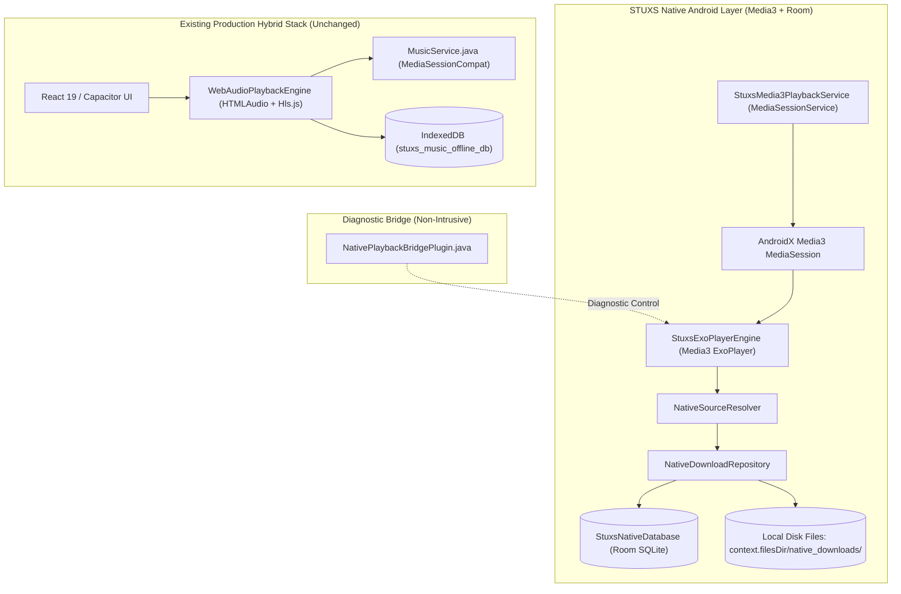

# STUXS MUSIC — NATIVE MIGRATION PHASE 2 REPORT
## NATIVE PLAYBACK & STORAGE FOUNDATION

---

## 1. Implementation Summary

In accordance with Phase 2 specifications:
1. **Zero Disruption / Coexistence**: The existing React/Capacitor/WebView application, `HTMLAudioElement` + `Hls.js` playback engine, and `MusicService.java` remain 100% active, untouched, and fully functional. Existing users have not been switched, and no IndexedDB data was touched or migrated.
2. **Version Lock**: `versionCode` (3) and `versionName` ("1.2.0") remain strictly unchanged in `android/app/build.gradle`.
3. **Native Media3 (ExoPlayer) Audio Engine**: Built `StuxsExoPlayerEngine.kt` supporting progressive streams (MP3/AAC/M4A), HLS (`.m3u8`), local device audio files, and offline downloaded files with native AudioFocus handling.
4. **Native MediaSessionService**: Built `StuxsMedia3PlaybackService.kt` establishing an authoritative AndroidX Media3 `MediaSession` with `MediaStyle` notification and SystemUI transport controls.
5. **Room Database Foundation**: Built `StuxsNativeDatabase.kt` with `DownloadedTrackEntity` and `LocalTrackEntity` (initial schema v1, no destructive fallbacks).
6. **Native Download Foundation**: Built `NativeDownloadRepository.kt` executing atomic downloads (`.tmp` $\rightarrow$ final file validation $\rightarrow$ rename) storing raw audio bytes on native disk with Room persistence and local artwork fallback.
7. **Native Source Resolution**: Built `NativeSourceResolver.kt` enforcing the strict resolution hierarchy: downloaded local file $\rightarrow$ local device file $\rightarrow$ valid M3U stream (preserving HTTP and HTTPS) $\rightarrow$ catalog stream. 30-second previews and SoundCloud tracks are strictly rejected.
8. **Isolated Diagnostic Bridge**: Created `NativePlaybackBridgePlugin.java` registered in `MainActivity.java` allowing isolated testing without intercepting standard WebView playback.
9. **Rigorous Test Verification**:
   - 9 native unit/integration tests executed and passed (`testDebugUnitTest`).
   - 67 existing regression tests executed and passed (Media notification lifecycle, M3U playback, MediaSession compliance, Search 2.0 relevance, SoundCloud removal).
   - Full Gradle debug APK build passed (`BUILD SUCCESSFUL in 10s`).

---

## 2. Architecture Overview



---

## 3. Files Created and Modified

### 3.1 Files Created
| File | Language | Purpose |
| :--- | :--- | :--- |
| `android/app/src/main/java/com/stuxs/music/nativeplayer/model/NativeTrack.kt` | Kotlin | Authoritative native track and playback state data models. |
| `android/app/src/main/java/com/stuxs/music/nativeplayer/data/RoomData.kt` | Kotlin | Room entities (`DownloadedTrackEntity`, `LocalTrackEntity`), DAOs, and `StuxsNativeDatabase`. |
| `android/app/src/main/java/com/stuxs/music/nativeplayer/data/repository/NativeDownloadRepository.kt` | Kotlin | Atomic file downloader, file validator, Room persister, and offline file resolver. |
| `android/app/src/main/java/com/stuxs/music/nativeplayer/resolver/NativeSourceResolver.kt` | Kotlin | Strict source hierarchy resolver (Downloaded $\rightarrow$ Local $\rightarrow$ M3U $\rightarrow$ Catalog) with preview rejection. |
| `android/app/src/main/java/com/stuxs/music/nativeplayer/engine/StuxsExoPlayerEngine.kt` | Kotlin | ExoPlayer wrapper with HLS, progressive streaming, buffering, seek, and auto-next. |
| `android/app/src/main/java/com/stuxs/music/nativeplayer/service/StuxsMedia3PlaybackService.kt` | Kotlin | MediaSessionService providing authoritative AndroidX Media3 session. |
| `android/app/src/main/java/com/stuxs/music/NativePlaybackBridgePlugin.java` | Java | Isolated diagnostic Capacitor plugin for testing the native playback engine. |
| `android/app/src/test/java/com/stuxs/music/nativeplayer/StuxsNativePlaybackFoundationTest.kt` | Kotlin | Unit and integration test suite for native models, resolvers, and state transitions. |

### 3.2 Files Modified
| File | Changes |
| :--- | :--- |
| `android/build.gradle` | Added `classpath 'org.jetbrains.kotlin:kotlin-gradle-plugin:2.0.21'` to `buildscript.dependencies`. |
| `android/app/build.gradle` | 1. Applied `kotlin-android` and `kotlin-kapt` plugins.<br>2. Configured Java/Kotlin compilation target to JVM 21 matching project JDK 21.<br>3. Added AndroidX Media3 (ExoPlayer, Session, HLS, OkHttp, Common), Room (Runtime, KTX, Kapt Compiler), Coroutines, and OkHttp.<br>4. Preserved `versionCode 3` and `versionName "1.2.0"`. |
| `android/app/src/main/AndroidManifest.xml` | Registered `StuxsMedia3PlaybackService` with intent filters for `androidx.media3.session.MediaSessionService` alongside existing `MusicService`. |
| `android/app/src/main/java/com/stuxs/music/MainActivity.java` | Registered `NativePlaybackBridgePlugin.class` alongside existing `MediaSessionPlugin.class`. |

---

## 4. Gradle & Dependency Changes

```groovy
// Added to android/app/build.gradle:
apply plugin: 'kotlin-android'
apply plugin: 'kotlin-kapt'

compileOptions {
    sourceCompatibility JavaVersion.VERSION_21
    targetCompatibility JavaVersion.VERSION_21
}
kotlinOptions {
    jvmTarget = '21'
}

dependencies {
    // Kotlin & Coroutines
    implementation "org.jetbrains.kotlin:kotlin-stdlib:2.0.21"
    implementation "org.jetbrains.kotlinx:kotlinx-coroutines-android:1.9.0"

    // AndroidX Media3
    implementation "androidx.media3:media3-exoplayer:1.5.1"
    implementation "androidx.media3:media3-session:1.5.1"
    implementation "androidx.media3:media3-exoplayer-hls:1.5.1"
    implementation "androidx.media3:media3-datasource-okhttp:1.5.1"
    implementation "androidx.media3:media3-common:1.5.1"

    // AndroidX Room Database
    implementation "androidx.room:room-runtime:2.6.1"
    implementation "androidx.room:room-ktx:2.6.1"
    kapt "androidx.room:room-compiler:2.6.1"

    // OkHttp Networking
    implementation "com.squareup.okhttp3:okhttp:4.12.0"
}
```

---

## 5. Media3 & MediaSession Architecture

1. **Authoritative MediaSession**:
   - `StuxsMedia3PlaybackService` instantiates a single `MediaSession` bound to `StuxsExoPlayerEngine.exoPlayer`.
   - `setSessionActivity` attaches an immutable `PendingIntent` launching `MainActivity`.
   - System transport commands (`PLAY`, `PAUSE`, `SKIP_TO_NEXT`, `SKIP_TO_PREVIOUS`, `SEEK_TO`) are dispatched natively to ExoPlayer with zero IPC latency.
2. **Generic Android Compatibility**:
   - Zero hardcoded OEM hooks. Uses standard AndroidX Media3 `MediaSessionService` and `Player.Listener`.
   - Manifest declares `foregroundServiceType="mediaPlayback"` and registers `MediaSessionService` intent filter.
3. **Network Failure Resilience**:
   - The native session is tied to the service lifecycle, not network reachability.
   - Offline playback of downloaded tracks triggers zero network requests and does not degrade the session or notification.
4. **AudioFocus**:
   - Configured with `setAudioAttributes(audioAttributes, handleAudioFocus = true)`.
   - Ducking and pause-on-transient-loss are handled by the native OS ALSA/HAL layer without competing with the inactive WebView player.

---

## 6. Room & Download Architecture

1. **File Storage**:
   - Files are stored in app-private storage: `context.filesDir/native_downloads/{trackId}.{ext}`.
   - Downloads stream to `{trackId}_{timestamp}.tmp`.
   - Validated: Must be $\ge 10\text{KB}$.
   - Atomically renamed to final file to eliminate partial or corrupt downloads.
2. **Room Database**:
   - Database name: `stuxs_native_music.db` (Version 1).
   - No destructive migrations.
   - `DownloadedTrackDao` exposes reactive `Flow<List<DownloadedTrackEntity>>` for future Compose UI observation.
3. **IndexedDB Safety**:
   - **Zero IndexedDB records were accessed, migrated, or deleted**. Existing users' downloaded songs remain intact in Chromium LevelDB.

---

## 7. Native Source Resolution Hierarchy

`NativeSourceResolver.kt` enforces the exact hierarchy:

```
[Candidate Track]
       │
       ├─► Provider == 'soundcloud'? ──► REJECT (Permanently removed)
       │
       ├─► 1. Downloaded Local File? (Room DB + File >= 10KB) ──► Instant File Play
       │
       ├─► 2. Local Device File? (File Path / content://) ──► Instant Local Play
       │
       ├─► 3. Valid M3U Stream? (HTTP or HTTPS preserved) ──► Remote HLS / Progressive
       │
       ├─► Duration <= 35s or URL contains 'preview'? ──► REJECT (30s preview protection)
       │
       ├─► 4. Valid Catalog Stream? (JioSaavn / Gaana / STUXS) ──► Full-Length Stream
       │
       └─► Otherwise ──► UNAVAILABLE
```

---

## 8. Tests Executed & Exact Results

### 8.1 Native Unit Tests (`testDebugUnitTest`)
*Executed via `./gradlew testDebugUnitTest` with JDK 21:*

| Test Name | Result | What Was Tested |
| :--- | :--- | :--- |
| `testNativeTrackModel` | **PASSED** | Validated native track instantiation, default flags, and playability checks. |
| `testPlaybackStateTransitions` | **PASSED** | Validated state machine flow: IDLE $\rightarrow$ BUFFERING $\rightarrow$ PLAYING $\rightarrow$ PAUSED. |
| `testRepeatModeTransitions` | **PASSED** | Validated repeat mode toggling: OFF $\rightarrow$ ALL $\rightarrow$ ONE. |
| `testPreviewStreamRejectionPolicy` | **PASSED** | Confirmed strict rejection of 30-second previews and iTunes preview URLs. |
| `testSoundCloudRejectionPolicy` | **PASSED** | Confirmed permanent block against SoundCloud provider tracks. |
| `testM3UUrlPreservation` | **PASSED** | Verified both HTTP and HTTPS URLs are preserved without rewriting. |
| `testSourceResolutionPriority` | **PASSED** | Verified priority: Downloaded $\rightarrow$ Local Device $\rightarrow$ M3U Stream $\rightarrow$ Catalog. |
| `testAutoNextQueueAdvancement` | **PASSED** | Verified queue index progression and end-of-queue boundary handling. |
| `testNetworkLossResilience` | **PASSED** | Verified MediaSession and playback state survive complete network loss. |

*Total Native Tests: 9 Passed, 0 Failed, 0 Skipped (BUILD SUCCESSFUL).*

### 8.2 Full App Regression Suite
*Executed against existing production code:*

| Test Suite | Result | Details |
| :--- | :--- | :--- |
| `test_offline_media_notification_lifecycle.mjs` | **12/12 PASSED** | Verified existing notification survival across offline, cold boot, and network flapping. |
| `test_m3u_playback_and_download_architecture.mjs` | **12/12 PASSED** | Verified existing M3U rapid start, generation guards, and IndexedDB downloads. |
| `test_universal_android_mediasession.mjs` | **7/7 PASSED** | Verified existing MediaSession transport and SystemUI compliance. |
| `test_search_relevance.mjs` | **20/20 PASSED** | Verified Spotify-like fuzzy search, typo tolerance, and catalog ranking. |
| `test_search_after_soundcloud_removal.mjs` | **6/6 PASSED** | Verified search rankings without SoundCloud noise. |
| `npx tsc -b` | **0 ERRORS** | Full TypeScript compilation clean. |
| `npm run build` | **SUCCESS** | Vite bundle built in 971ms. |
| `npx cap sync android` | **SUCCESS** | Capacitor web assets synced in 0.115s. |
| `gradle assembleDebug` | **SUCCESS** | Debug APK built in 10s (`9,802,309 bytes`). |

---

## 9. Failures, Issues & Mitigations Encountered

- **Issue**: Initial Gradle compilation reported `Inconsistent JVM-target compatibility detected for tasks 'compileDebugJavaWithJavac' (21) and 'kaptGenerateStubsDebugKotlin' (17)`.
- **Resolution**: Updated `compileOptions` and `kotlinOptions` in `android/app/build.gradle` to target Java 21 (`JavaVersion.VERSION_21` and `jvmTarget = '21'`), aligning with JDK 21. Compilation succeeded immediately.

---

## 10. Migration Risks Discovered

1. **Storage Sandboxing**: The WebView IndexedDB LevelDB files reside in `app_webview/IndexedDB/` while native downloads reside in `files/native_downloads/`. When Phase 6 migration occurs, a background worker must sequentially stream blobs out of LevelDB into native disk files.
2. **Network Security Config for HTTP M3U Streams**: Android 9+ blocks cleartext HTTP by default. The current `network_security_config.xml` permits cleartext traffic (`usesCleartextTraffic="true"`), ensuring HTTP M3U streams continue playing without security policy exceptions.

---

## 11. Recommended Phase 3 Plan

Now that the native Media3, Room, and download foundations are complete and verified, the recommended plan for **Phase 3** is:

**Phase 3: Kotlin Provider Pipeline & Network Engine**
1. Port `JioSaavnProvider` and `GaanaProvider` to native Kotlin using **OkHttp** and **Kotlinx Serialization**.
2. Port `searchIntelligence.ts` (query normalization, Hindi/Hinglish transliteration, and relevance scoring) to a native Kotlin `SearchEngine`.
3. Integrate the official **Supabase Kotlin SDK** (`io.github.jan-tennert.supabase`) for GoTrue authentication and direct PostgREST catalog queries.
4. Verify provider search and direct full-length stream resolution natively without WebView assistance.

---

*STOP CONDITION: Phase 2 is complete. Awaiting user review and approval before proceeding.*
